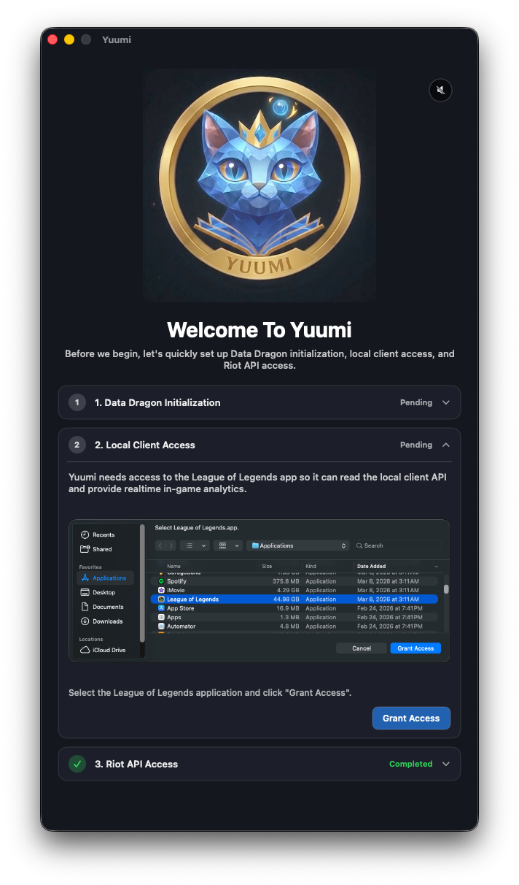
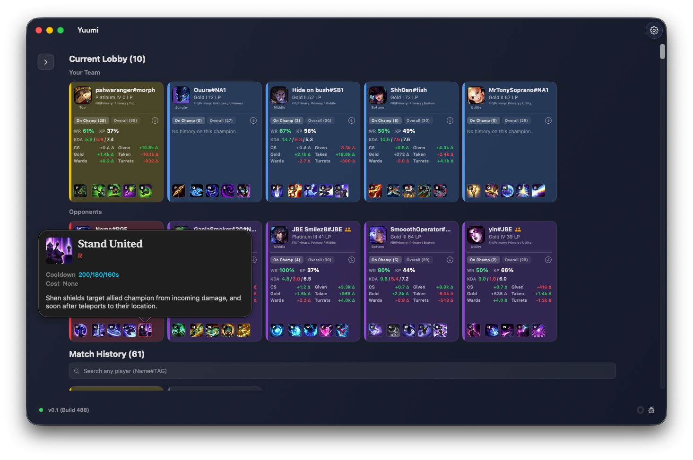
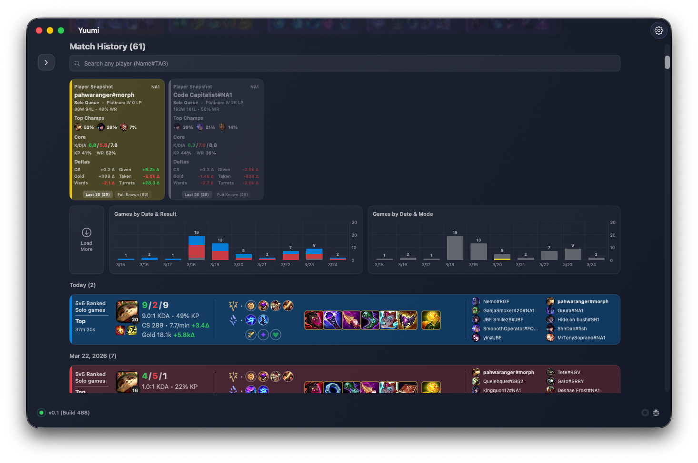
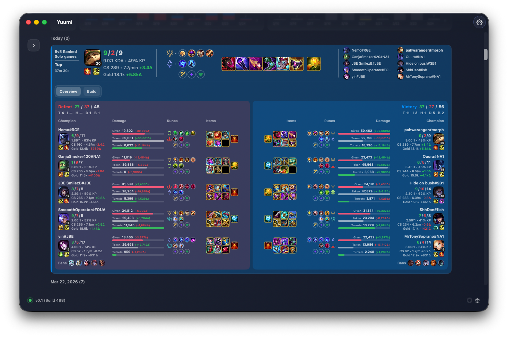

# Yuumi

Yuumi is a macOS SwiftUI companion app for League of Legends that provides real-time, in-game, pre-game, and post-game analytics.

This is a placeholder repo while the code is prepared for OSS.

## Download

[Download Yuumi.dmg](https://raw.githubusercontent.com/pahwaranger/yuumi_lol/master/Yuumi.dmg)

## Demo Mode

[Demo Mode Guide](./demo-mode.md)

## What it does

- Detects League Client state and polls core LCU endpoints.
- Resolves player identity using reliable LCU fallbacks (`puuid`, `summonerId`, Riot ID) to support lobby/champ-select contexts.
- Loads Riot API match history and rank data with rate-limit-aware pacing.
- Persists match history in SQLite and caches API/static assets to improve responsiveness.
- Shows in-app diagnostics for lockfile, API status, and identity resolution.
- Supports a launch-only Demo Mode with bundled/local state snapshots for review demos.

## Requirements

- macOS 13+
- League of Legends desktop client installed

## Tech stack

- Swift 5.9+
- SwiftUI (macOS app)
- Xcode project workflow (`Yuumi.xcodeproj` / `Yuumi` scheme)
- SQLite-backed match history storage

## Screenshots

